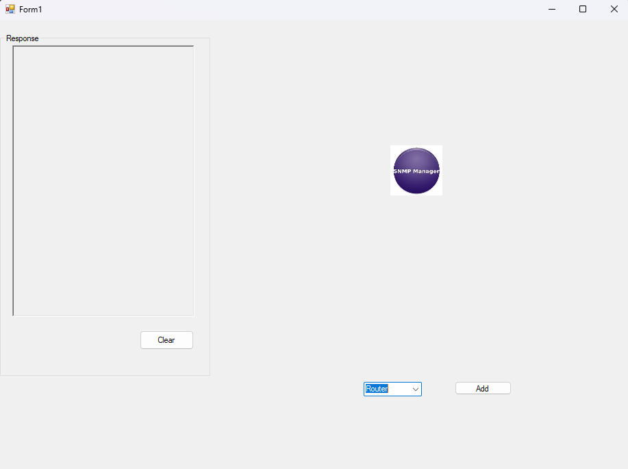
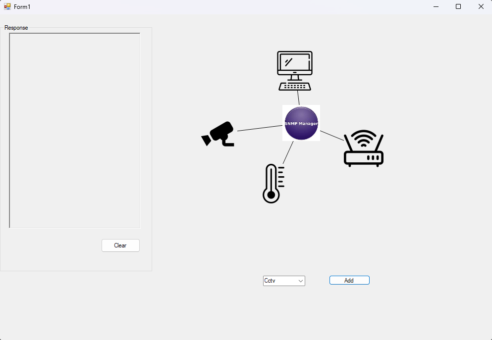
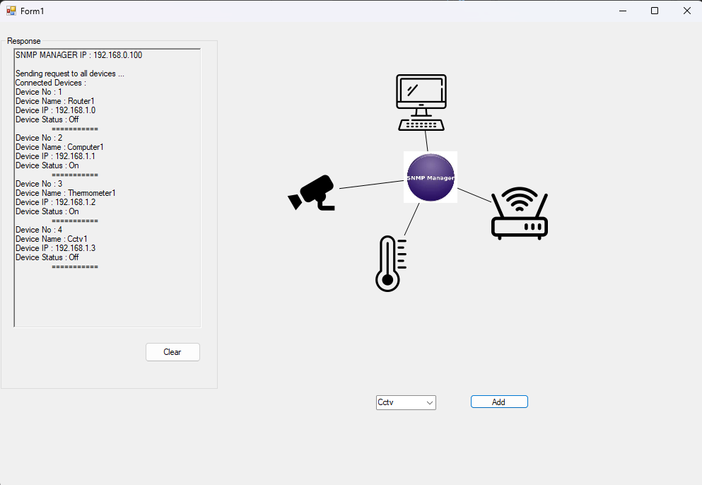

# SNMP Network Simulator

A Windows Forms desktop application built in C# that simulates an SNMP (Simple Network Management Protocol) network topology. Users can dynamically add network devices, connect them to an SNMP Manager, drag them across the canvas, and query their status — all in real time.

---

## Features

- **Dynamic Device Management** — Add Routers, Thermometers, Computers, and CCTV cameras at runtime via a dropdown menu
- **Live Network Topology** — Devices are visually connected to the SNMP Manager with lines that update as you drag devices around the canvas
- **Drag and Drop Canvas** — Every device is draggable; the network diagram redraws automatically on move
- **SNMP Manager Polling** — Click the SNMP Manager to poll all connected devices and display their name, IP address, and status
- **Device Click Events** — Click any individual device to see its trap/send data output in the log panel
- **Auto IP Assignment** — Each new device is automatically assigned a unique IP address
- **Random Device Status** — Devices are assigned On/Off status on creation to simulate a live network
- **Activity Log** — A scrollable rich text box logs all SNMP events, device responses, and status updates
- **Clear Log** — One-click button to clear the activity log

---

## OOP Concepts Used

| Concept | Where Applied |
|---|---|
| Inheritance | `Router`, `Thermometer`, `Computer`, `Cctv` all extend `NetworkDevice` |
| Polymorphism | `SendData()` is overridden in each subclass |
| Encapsulation | Device properties (`IPAddress`, `DeviceStatus`) are encapsulated in `NetworkDevice` |
| Static Members | `TotalRouters`, `TotalThermometer`, etc. track instance counts per class |
| Event Handling | `LocationChanged`, `Click` events wired per device dynamically |

---

## Screenshots

**Main Window**



When the application launches, only the SNMP Manager is visible on the canvas. The log panel on the left is empty and ready to record activity. The dropdown at the bottom lets you select a device type to add to the network.

---

**Device Added**



After adding multiple devices, each one appears on the canvas connected to the SNMP Manager via a line. The topology updates in real time as devices are added or dragged to new positions. Devices shown here include a Router, Computer, Thermometer, and CCTV camera, all linked to the central SNMP Manager.

---

**SNMP Poll**



Clicking the SNMP Manager triggers a poll of all connected devices. The log panel displays each device's name, assigned IP address, and current status (On/Off). The poll runs with a 1-second delay between each device response to simulate real network behaviour.

---

## Requirements

- Windows 10 or later
- [.NET Framework 4.7.2](https://dotnet.microsoft.com/en-us/download/dotnet-framework/net472)
- Visual Studio 2019 or later (Community edition is fine)

---

## Setup & Run

1. **Clone the repository**
   ```bash
   git clone https://github.com/rehan-faisal0/SNMP-Network-Simulator.git
   cd snmp-network-simulator
   ```

2. **Open the solution**
   - Double-click `OOP_Project.sln` in Visual Studio

3. **Build and Run**
   - All device images are included in the `assets/` folder and will be copied to the output directory automatically on build
   ```
   Build → Rebuild Solution
   Press F5
   ```

---

## Usage

1. Select a device type from the dropdown (Router, Thermometer, Computer, Cctv)
2. Click **Add Device** — the device appears on the canvas connected to the SNMP Manager
3. **Drag** any device to reposition it on the canvas
4. **Click** any device to see its data output in the log
5. **Click the SNMP Manager** to poll all connected devices and view their status
6. Click **Clear** to reset the activity log

---

## Project Structure

```
OOP_Project/
├── assets/                 # Device images (copied to bin\Debug\assets\ on build)
│   ├── images.jpg          # SNMP Manager icon
│   ├── wifi-router.png
│   ├── thermometer.png
│   ├── computer.png
│   └── cctv_icon_135799.png
├── screenshots/            # Application screenshots for README
│   ├── main.png
│   ├── device_added.png
│   └── snmp_poll.png
├── NetworkDevices.cs       # All network device classes (NetworkDevice, Router, etc.)
├── MainForm.cs             # Main form logic and event handlers
├── MainForm.Designer.cs    # Auto-generated designer file
├── Program.cs              # Entry point
└── App.config              # Runtime configuration (.NET 4.7.2)
```

---

## Author

**Rehan Faisal**  
BS Cybersecurity — Air University, Islamabad